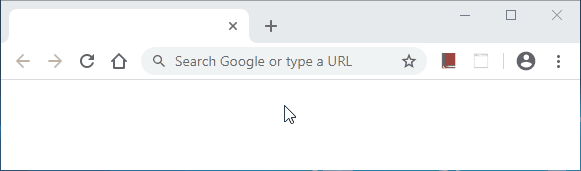

# GazeUI for Spring Boot

GazeUI lets you create front-end web applications using your server-side language of choice! No HTML, no CSS, no client-side JavaScript. This is the module that will allow you to plug GazeUI into your [Spring Boot](https://spring.io/projects/spring-boot) project.

## Getting Started

1. Add the GazeUI library to your project classpath;

2. Enable GazeUI on your project adding the `@EnableGazeUI` annotation:

    ```java
    @SpringBootApplication
    @EnableGazeUI(mainWindowClass = MainWindow.class)
    public class MySpringBootApp {
        
        public static void main(String[] args) {
            SpringApplication.run(MySpringBootApp.class, args);
        }
    }
    ```

3. Create your application main window, with some controls and responses to user actions:

    ```java
    public class MainWindow extends Window {
        private Button buttonSayHello;
        private Label labelHelloWorld;
        
        public MainWindow() {
            this.buttonSayHello = new Button("Say Hello");
            this.buttonSayHello.addOnClickHandler(this::buttonSayHello_OnClick);
            
            this.labelHelloWorld = new Label();
            
            this.getControls().add(this.buttonSayHello);
            this.getControls().add(this.labelHelloWorld);
        }
        
        private void buttonSayHello_OnClick(EventArgs e) {
            this.labelHelloWorld.setText("Hello World!");
        }
    }
    ```

4. Voilà! Here is what you get:

    

## Future Plan

- Great look and feel themes
- More controls (TextBox, MaskedTextBox, CheckBox, ListBox, DateTimePicker, GridView, Dialog, Menu, etc.)
- GazeUI IDE

## License

This project is licensed under the terms of the MIT license. See the [LICENSE](LICENSE) file for details.

## Browser Compatibility Matrix<sup>[1]</sup>

<table>
<thead>
    <tr>
        <th rowspan="2">Feature</th>
        <th colspan="6">Desktop</th>
        <th colspan="6">Mobile</th>
        <th rowspan="2">Global Usage</th>
    </tr>
    <tr>
        <th>IE</th>
        <th>Edge</th>
        <th>Firefox</th>
        <th>Chrome</th>
        <th>Safari</th>
        <th>Opera</th>
        <th>iOS (Safari)</th>
        <th>Android (WebView)</th>
        <th>Opera Mobile</th>
        <th>Android (Chrome)</th>
        <th>Android (Firefox)</th>
        <th>Android (Samsung Internet)</th>
    </tr>
</thead>
<tbody>
    <tr>
        <td align="center">defer</td>
        <td align="center">10</td>
        <td align="center">12</td>
        <td align="center">31</td>
        <td align="center">8</td>
        <td align="center">5</td>
        <td align="center">15</td>
        <td align="center">5</td>
        <td align="center">3</td>
        <td align="center">46</td>
        <td align="center">78</td>
        <td align="center">68</td>
        <td align="center">4</td>
        <td align="center">97.39%</td>
    </tr>
    <tr>
        <td align="center">async</td>
        <td align="center">-</td>
        <td align="center">15</td>
        <td align="center">52</td>
        <td align="center">55</td>
        <td align="center">10.1<sup>[2]</sup></td>
        <td align="center">42</td>
        <td align="center">10.3<sup>[2]</sup></td>
        <td align="center">76</td>
        <td align="center">46</td>
        <td align="center">78</td>
        <td align="center">68</td>
        <td align="center">6.2</td>
        <td align="center">91.76%</td>
    </tr>
    <tr>
        <td align="center">await</td>
        <td align="center">-</td>
        <td align="center">14</td>
        <td align="center">52</td>
        <td align="center">55</td>
        <td align="center">10.1</td>
        <td align="center">42</td>
        <td align="center">10.3</td>
        <td align="center">76</td>
        <td align="center">46</td>
        <td align="center">78</td>
        <td align="center">68</td>
        <td align="center">6.2</td>
        <td align="center">89.1%</td>
    </tr>
    <tr>
        <td align="center">fetch()</td>
        <td align="center">-</td>
        <td align="center">14</td>
        <td align="center">40</td>
        <td align="center">42</td>
        <td align="center">10.1</td>
        <td align="center">29</td>
        <td align="center">10.3</td>
        <td align="center">76</td>
        <td align="center">46</td>
        <td align="center">78</td>
        <td align="center">68</td>
        <td align="center">4</td>
        <td align="center">93.81%</td>
    </tr>
    <tr>
        <td align="center">Response .body</td>
        <td align="center">-</td>
        <td align="center">?</td>
        <td align="center">65</td>
        <td align="center">52</td>
        <td align="center">-</td>
        <td align="center">39</td>
        <td align="center">-</td>
        <td align="center">76</td>
        <td align="center">46</td>
        <td align="center">78</td>
        <td align="center">68</td>
        <td align="center">6.2</td>
        <td align="center">73.94%</td>
    </tr>
    <tr>
        <td align="center">ReadableStream .getReader()</td>
        <td align="center">-</td>
        <td align="center">14</td>
        <td align="center">65</td>
        <td align="center">43</td>
        <td align="center">?</td>
        <td align="center">30</td>
        <td align="center">?</td>
        <td align="center">76</td>
        <td align="center">46</td>
        <td align="center">78</td>
        <td align="center">68</td>
        <td align="center">4</td>
        <td align="center">75.3%</td>
    </tr>
    <tr>
        <td align="center">ReadableStreamDefaultReader .read()</td>
        <td align="center">?</td>
        <td align="center">?</td>
        <td align="center">65</td>
        <td align="center">?</td>
        <td align="center">?</td>
        <td align="center">?</td>
        <td align="center">?</td>
        <td align="center">?</td>
        <td align="center">?</td>
        <td align="center">?</td>
        <td align="center">68</td>
        <td align="center">?</td>
        <td align="center">3.86%</td>
    </tr>
    <tr>
        <td align="center">TextDecoder .decode()</td>
        <td align="center">-</td>
        <td align="center">?</td>
        <td align="center">18</td>
        <td align="center">38</td>
        <td align="center">10.1</td>
        <td align="center">25</td>
        <td align="center">10.3</td>
        <td align="center">76</td>
        <td align="center">?</td>
        <td align="center">78</td>
        <td align="center">68</td>
        <td align="center">?</td>
        <td align="center">87.56%</td>
    </tr>
    <tr>
        <td align="center">let</td>
        <td align="center">-</td>
        <td align="center">12</td>
        <td align="center">44</td>
        <td align="center">41<sup>[3]</sup></td>
        <td align="center">11</td>
        <td align="center">28<sup>[3]</sup></td>
        <td align="center">11</td>
        <td align="center">76</td>
        <td align="center">46</td>
        <td align="center">78</td>
        <td align="center">68</td>
        <td align="center">4<sup>[3]</sup></td>
        <td align="center">92.83%</td>
    </tr>
    <tr>
        <td align="center">use strict</td>
        <td align="center">10</td>
        <td align="center">12</td>
        <td align="center">4</td>
        <td align="center">13</td>
        <td align="center">6</td>
        <td align="center">12.1</td>
        <td align="center">5</td>
        <td align="center">3</td>
        <td align="center">12</td>
        <td align="center">78</td>
        <td align="center">68</td>
        <td align="center">4</td>
        <td align="center">97.89%</td>
    </tr>
    <tr>
        <td align="center">getElementById()</td>
        <td align="center">6</td>
        <td align="center">12</td>
        <td align="center">2</td>
        <td align="center">4</td>
        <td align="center">3.1</td>
        <td align="center">10</td>
        <td align="center">3.2</td>
        <td align="center">?</td>
        <td align="center">12</td>
        <td align="center">78</td>
        <td align="center">68</td>
        <td align="center">4</td>
        <td align="center">93.93%</td>
    </tr>
    <tr>
        <td align="center">createElement()</td>
        <td align="center">6</td>
        <td align="center">12</td>
        <td align="center">?</td>
        <td align="center">4</td>
        <td align="center">?</td>
        <td align="center">?</td>
        <td align="center">?</td>
        <td align="center">?</td>
        <td align="center">?</td>
        <td align="center">78</td>
        <td align="center">68</td>
        <td align="center">?</td>
        <td align="center">76.28%</td>
    </tr>
    <tr>
        <td align="center">appendChild()</td>
        <td align="center">6</td>
        <td align="center">12</td>
        <td align="center">?</td>
        <td align="center">?</td>
        <td align="center">?</td>
        <td align="center">?</td>
        <td align="center">?</td>
        <td align="center">?</td>
        <td align="center">?</td>
        <td align="center">78</td>
        <td align="center">68</td>
        <td align="center">?</td>
        <td align="center">67.33%</td>
    </tr>
    <tr>
        <td align="center">remove()</td>
        <td align="center">-</td>
        <td align="center">?</td>
        <td align="center">23</td>
        <td align="center">24</td>
        <td align="center">?</td>
        <td align="center">15</td>
        <td align="center">7</td>
        <td align="center">4.4</td>
        <td align="center">46</td>
        <td align="center">78</td>
        <td align="center">68</td>
        <td align="center">4</td>
        <td align="center">94.69%</td>
    </tr>
    <tr>
        <td align="center">insertBefore()</td>
        <td align="center">9</td>
        <td align="center">12</td>
        <td align="center">3</td>
        <td align="center">4</td>
        <td align="center">?</td>
        <td align="center">?</td>
        <td align="center">?</td>
        <td align="center">2.1</td>
        <td align="center">?</td>
        <td align="center">78</td>
        <td align="center">68</td>
        <td align="center">?</td>
        <td align="center">78.27%</td>
    </tr>
    <tr>
        <td align="center">document .title</td>
        <td align="center">?</td>
        <td align="center">12</td>
        <td align="center">?</td>
        <td align="center">4</td>
        <td align="center">?</td>
        <td align="center">?</td>
        <td align="center">?</td>
        <td align="center">?</td>
        <td align="center">?</td>
        <td align="center">78</td>
        <td align="center">68</td>
        <td align="center">?</td>
        <td align="center">74.58%</td>
    </tr>
    <tr>
        <td align="center">textContent</td>
        <td align="center">9</td>
        <td align="center">12</td>
        <td align="center">2</td>
        <td align="center">4</td>
        <td align="center">?</td>
        <td align="center">10</td>
        <td align="center">?</td>
        <td align="center">?</td>
        <td align="center">12</td>
        <td align="center">78</td>
        <td align="center">68</td>
        <td align="center">4</td>
        <td align="center">98.74%</td>
    </tr>
    <tr>
        <td align="center">JSON .stringify</td>
        <td align="center">8</td>
        <td align="center">12</td>
        <td align="center">3.5</td>
        <td align="center">4</td>
        <td align="center">4</td>
        <td align="center">11.5</td>
        <td align="center">?</td>
        <td align="center">?</td>
        <td align="center">12</td>
        <td align="center">78</td>
        <td align="center">68</td>
        <td align="center">4</td>
        <td align="center">84.04%</td>
    </tr>
    <tr>
        <td align="center">event .target</td>
        <td align="center">?</td>
        <td align="center">12</td>
        <td align="center">?</td>
        <td align="center">?</td>
        <td align="center">?</td>
        <td align="center">?</td>
        <td align="center">?</td>
        <td align="center">?</td>
        <td align="center">?</td>
        <td align="center">78</td>
        <td align="center">68</td>
        <td align="center">?</td>
        <td align="center">69.63%</td>
    </tr>
    <tr>
        <td align="center">event .currentTarget</td>
        <td align="center">9</td>
        <td align="center">12</td>
        <td align="center">?</td>
        <td align="center">?</td>
        <td align="center">10</td>
        <td align="center">?</td>
        <td align="center">10</td>
        <td align="center">?</td>
        <td align="center">?</td>
        <td align="center">78</td>
        <td align="center">68</td>
        <td align="center">?</td>
        <td align="center">80.43%</td>
    </tr>
    <tr>
        <td align="center">event .stopImmediatePropagation()</td>
        <td align="center">9</td>
        <td align="center">12</td>
        <td align="center">10</td>
        <td align="center">6</td>
        <td align="center">5</td>
        <td align="center">15</td>
        <td align="center">5</td>
        <td align="center">?</td>
        <td align="center">46</td>
        <td align="center">78</td>
        <td align="center">68</td>
        <td align="center">4</td>
        <td align="center">93.71%</td>
    </tr>
    <tr>
        <td align="center">addEventListener()</td>
        <td align="center">9</td>
        <td align="center">12</td>
        <td align="center">7</td>
        <td align="center">4</td>
        <td align="center">3.1</td>
        <td align="center">10</td>
        <td align="center">3.2</td>
        <td align="center">2.1</td>
        <td align="center">12</td>
        <td align="center">78</td>
        <td align="center">68</td>
        <td align="center">4</td>
        <td align="center">98.74%</td>
    </tr>
    <tr>
        <td align="center">removeEventListener()</td>
        <td align="center">9</td>
        <td align="center">12</td>
        <td align="center">2</td>
        <td align="center">4</td>
        <td align="center">3.1</td>
        <td align="center">10</td>
        <td align="center">3.2</td>
        <td align="center">2.1</td>
        <td align="center">12</td>
        <td align="center">78</td>
        <td align="center">68</td>
        <td align="center">4</td>
        <td align="center">94.07%</td>
    </tr>
</tbody>
<tfoot>
    <tr>
        <th>Result</th>
        <td align="center">-</td>
        <td align="center">15</td>
        <td align="center">65</td>
        <td align="center">55</td>
        <td align="center">11</td>
        <td align="center">42</td>
        <td align="center">11</td>
        <td align="center">76</td>
        <td align="center">46</td>
        <td align="center">78</td>
        <td align="center">68</td>
        <td align="center">6.2</td>
        <td align="center">3.86%</td>
    </tr>
</tfoot>
</table>

1. Updated at December 10, 2019
2. Async arrow functions are unsupported
3. Only supported in strict mode