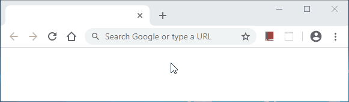

# GazeUI for Spring Boot

GazeUI lets you create front-end web applications using your server-side language of choice!
No HTML, no CSS, no client-side JavaScript. This is the module that will allow you to plug GazeUI
into your [Spring Boot](https://spring.io/projects/spring-boot) project.

## Getting Started

1. Add the GazeUI library to your project classpath;

2. Enable GazeUI on your project adding the `@EnableGazeUI` annotation:

    ```java
    @SpringBootApplication
    @EnableGazeUI(mainWindowClass = MainWindow.class)
    public class MySpringBootApp {
        
        public static void main(String[] args) {
            SpringApplication.run(MySpringBootApp.class, args);
        }
    }
    ```

3. Create your application main window, with some controls and responses to user actions:

    ```java
    public class MainWindow extends Window {
        private Button buttonSayHello;
        private Label labelHelloWorld;
        
        public MainWindow() {
            this.buttonSayHello = new Button("Say Hello");
            this.buttonSayHello.addOnClickHandler(this::buttonSayHello_OnClick);
            
            this.labelHelloWorld = new Label();
            
            this.getControls().add(this.buttonSayHello);
            this.getControls().add(this.labelHelloWorld);
        }
        
        private void buttonSayHello_OnClick(EventArgs e) {
            this.labelHelloWorld.setText("Hello World!");
        }
    }
    ```

4. Voilà! Here is what you get:

    

## Future Plan

- Great look and feel themes
- More controls (TextBox, MaskedTextBox, CheckBox, ListBox, DateTimePicker, GridView, Dialog, Menu, etc.)
- GazeUI IDE

## Contributing

Please read [CONTRIBUTING.md](docs/CONTRIBUTING.md) for details on how to contribute and the process
for submitting pull requests to us.

## License

This project is licensed under the terms of the MIT license. See the [LICENSE](LICENSE) file for details.